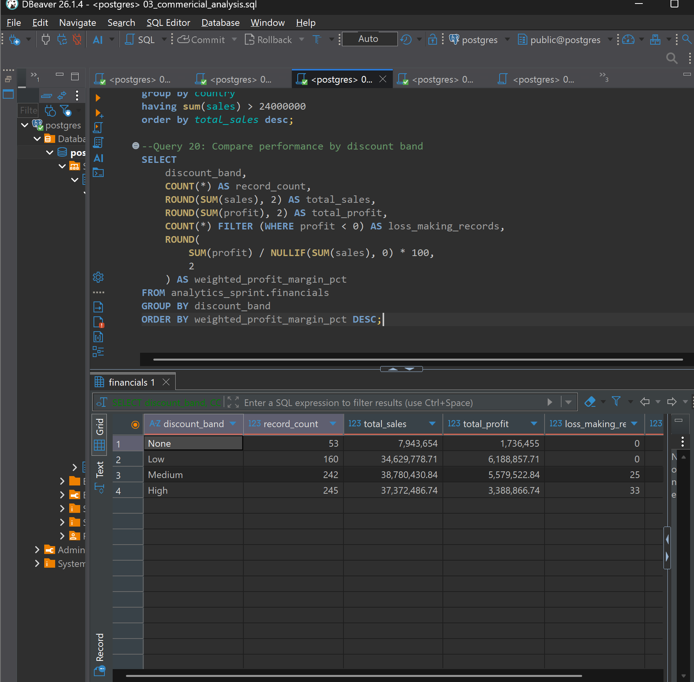
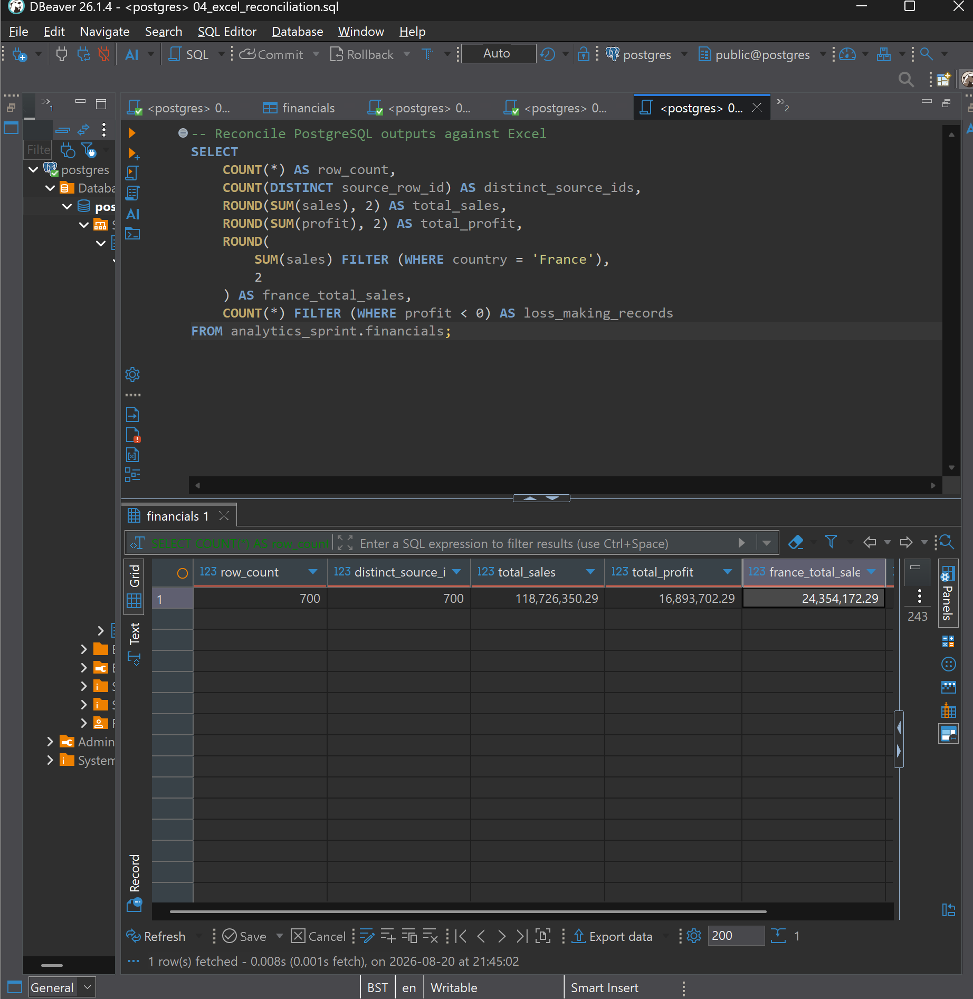

# Day 04 – PostgreSQL Financial Analysis

## Overview

Extended the preceding Excel and Power Query project into PostgreSQL by loading, validating and analysing Microsoft’s 700-row Financial Sample dataset.

I created a typed relational table, completed 20 SQL queries and reconciled the results against Excel to confirm that no records or financial values changed between tools.

## Skills demonstrated

- PostgreSQL table creation and data import
- Appropriate data types, constraints and primary keys
- Data validation and reconciliation
- `SELECT`, `WHERE`, `DISTINCT`, `IN` and `BETWEEN`
- `COUNT`, `SUM`, `AVG`, `GROUP BY` and `HAVING`
- Conditional aggregation using `FILTER`
- Sorting and ranking with `ORDER BY`
- Weighted profit-margin calculations
- Target variance and attainment analysis
- Troubleshooting import and query errors

## Analysis completed

The SQL analysis covered:

- Overall sales, profit and weighted margin
- Country, product and customer-segment performance
- Monthly sales and profit trends
- Loss-making records by country
- Discount-band performance
- Actual 2014 sales against illustrative country targets

## Key findings

- **Total sales:** $118.73 million
- **Total profit:** $16.89 million
- **Weighted profit margin:** 14.23%
- **Highest-sales country:** United States of America
- **Loss-making records:** 58

Results are descriptive and do not establish causal relationships.

## Validation

| Control | Result |
|---|---:|
| Rows | 700 |
| Distinct Source Row IDs | 700 |
| Missing core values | 0 |
| Total sales | $118,726,350.26 |
| Total profit | $16,893,702.26 |
| Earliest date | 2013-09-01 |
| Latest date | 2014-12-01 |

All controls matched the preceding Excel and Power Query analysis.

## Technical problem solved

The initial import failed because a leading space in the CSV `sales` header caused incorrect column mapping.

I identified the mismatch from PostgreSQL’s error details, corrected the source header, repeated the import and verified the completed table using row counts, unique IDs, missing-value checks and financial totals.

## Evidence

### Commercial analysis

### Cross-tool reconciliation

### Database validation

## Limitations

The project uses a public Microsoft sample dataset. Country targets are illustrative, and the findings describe associations rather than causation.

## Data source

[Microsoft Financial Sample workbook](https://learn.microsoft.com/en-us/power-bi/create-reports/sample-financial-download)